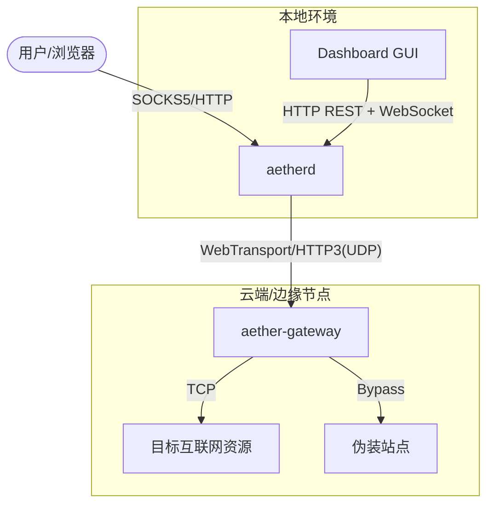

# Aether-Realist

<p align="center">
  
  
  
  
</p>

Aether-Realist 是一套基于 **WebTransport (HTTP/3)** 的高性能代理系统。当前实现由三部分组成：
- `aether-gateway`：服务端网关（二进制 + Docker 镜像）
- `aetherd`：本地 Core Daemon（SOCKS5/HTTP 代理 + 控制 API）
- GUI（Tauri + React）：调用 `aetherd` API 并订阅事件流

协议采用 **Zero-Sync V5**（SessionID + Counter）避免 nonce 复用，配合 WebTransport 多路复用实现低延迟与稳定吞吐。

---

## 🚀 核心优势

### 🛡️ 安全特性
*   **Zero-Sync V5**：`SessionID(4B)+Counter(8B)` 作为 nonce，避免 IV 同步问题。
*   **Metadata AES-128-GCM 加密**：握手目标信息加密并使用 Header 作为 AAD。
*   **抗重放**：时间窗口 + 单调计数器校验。
*   **会话轮换**：支持定时轮换与异常重连恢复。

### ⚡ 性能特性
*   **WebTransport over HTTP/3**：基于 QUIC 多路复用。
*   **16KB Record 分片**：数据面按 `MaxRecordPayload=16KB` 切片，降低弱网 HoL 惩罚。
*   **分级流控窗口 (`WINDOW_PROFILE`)**：
    * `conservative`: 512KB / 1.5MB / 2MB / 4MB
    * `normal`: 2MB / 3MB / 4MB / 8MB
    * `aggressive`: 4MB / 8MB / 32MB / 48MB
*   **窗口手工覆盖（可选）**：支持 `QUIC_*_RECV_WINDOW` 四个环境变量，对窗口做精细 A/B。
*   **可调分片大小 (`RECORD_PAYLOAD_BYTES`)**：默认 16KB，可按链路 A/B 调整（如 4KB/8KB/16KB）。
*   **大 UDP 缓冲**：客户端/网关均尝试设置 32MB UDP 读写缓冲。
*   **内置性能诊断 (`PERF_DIAG_ENABLE`)**：周期输出上下行读写/解析耗时与吞吐，便于定位下行瓶颈。

---

## 🏗️ 系统架构

Aether-Realist 当前实际架构如下：



### 组件说明
1.  **`aether-gateway` (服务端)**：同端口同时监听 UDP(H3/WebTransport) 与 TCP(TLS/health/decoy)。
2.  **`aetherd` (本地守护进程)**：对外提供 SOCKS5、HTTP 代理与 `/api/v1/*` 控制接口。
3.  **GUI**：通过本地 API 管理配置、切换系统代理、展示事件与指标。

---

## 🛠️ 快速开始

### 1. 服务端部署
通过 **一键脚本** 即可在几秒内启动完整的生产级网关：

```bash
# 下载、赋权并运行 (推荐)
curl -sL "https://raw.githubusercontent.com/coolapijust/Aether-Realist/main/deploy.sh?$(date +%s)" -o deploy.sh && chmod +x deploy.sh && ./deploy.sh
```

脚本将自动：
1. 检查 Docker 环境。
2. 生成/更新 `deploy/.env`。
3. 引导设置 `DOMAIN`、`PSK`、端口与伪装站目录。
4. 启动 `aether-gateway` 容器。

### 1.1 Native 部署（非 Docker）

适用于不希望引入 Docker 的环境（systemd + 本地二进制）。真正一键部署（无需提前 clone 仓库）：

```bash
curl -fsSL "https://raw.githubusercontent.com/coolapijust/Aether-Realist/main/deploy-native.sh?$(date +%s)" | sudo bash -s -- install
```

该脚本会把源码拉取/更新到 `/opt/aether-realist`，编译并安装二进制到 `/usr/local/bin/aether-gateway`，并写入 systemd 服务 `aether-gateway`。

> 详细参数配置请参阅：[部署指南](docs/deployment.md)
> 下载瓶颈定位可直接使用：`deploy/perf-tune.sh`（自动应用窗口预设、重启并抓 PERF 日志）。

### 2. 本地客户端
推荐直接使用 GUI（会启动并管理 `aetherd`）。

```bash
# 若需手动构建 core daemon
go build -o aetherd.exe ./cmd/aetherd
```

如需纯 CLI 客户端（无 GUI），见 `docs/client-go.md`。

---

## 📚 开发者手册

为了方便二次开发与集成，我们提供了详尽的规格说明：

*   📄 **[协议规范手册](docs/aether-realist-protocol.md)**：Record、加密、重放防护、分片策略。
*   🔌 **[API 规范指南](docs/api-specification.md)**：`aetherd` 本地 REST + WebSocket 事件流。
*   🗺️ **[设计文档](docs/design.md)**：当前代码架构与性能/安全权衡。

---

## 🌐 兼容性与兼容模式

### Cloudflare Worker 支持
项目保留了对 Cloudflare Worker 的代码级支持（见 `src/`）。
> **注意**：目前 Cloudflare Worker 尚未开启原生 WebTransport 支持。一旦平台功能就绪，现有代码即可立即生效。当前建议优先部署 Go 版本的 Gateway。

---

## 📄 开源协议
本项目采用 [MIT License](LICENSE) 许可协议。
