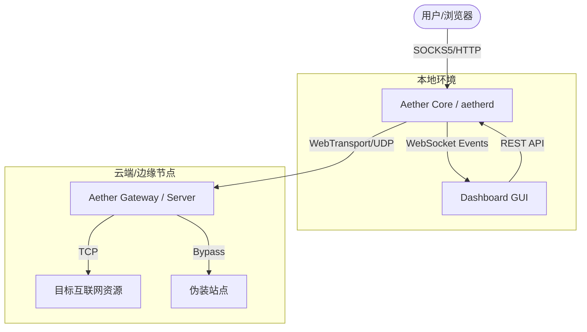

# Aether-Realist

<p align="center">
  
  
  
  
</p>

Aether-Realist 是一套基于 **WebTransport (HTTP/3)** 协议的高性能、无状态、生产级边缘中转系统。它采用创新的 **“零同步”(Zero-Sync) V5** 加密架构，通过 SessionID + Counter 机制彻底消除了高并发下的 nonce 复用风险，提供极致安全且稳定的隐蔽加密链路。

---

## 🚀 核心优势

### 🛡️ 极致安全与隐蔽
*   **零同步 (Zero-Sync) V5 架构**：引入 **SessionID (4B) + 单调计数器 (8B)** 复合 Nonce 机制，实现加密密钥与序列号的彻底脱钩。无论网络延迟或乱序，双端均能即时计算出完全一致的密钥，并提供确定性的抗重放（Anti-Replay）保证。
*   **自愈式会话 (Self-Healing)**：内置“心跳暂停感知”与“透明重连”机制。即使在长连接因网络或运营商原因断开后，系统毫秒级内自动恢复隧道，用户完全无感。
*   **流量混淆 (Traffic Obfuscation)**：在常规 TLS 1.3 基础上，增加 **2KB-16KB 随机化分块** 策略。彻底打破应用层数据大小与网络包大小的关联，有效规避基于包长度的 DPI 识别。
*   **元数据加密 (AES-GCM)**：所有流建立信息（Metadata）均经过 `AES-128-GCM` 强加密，**强制 16 字节认证标签**，确保即便握手过程也被完全掩盖。
*   **会话动态轮换 (Rotation)**：支持基于时间或计数器（2^32 Rekey 阈值）的自动连接轮换，彻底消除长连接带来的统计学指纹特征。

### ⚡ 卓越性能
*   **WebTransport 原生驱动**：利用 HTTP/3 的 QUIC 多路复用特性，彻底解决传统代理的队头阻塞（Head-of-Line Blocking）问题。
*   **BDP 深度调优**：针对跨境高延迟链路（RTT > 200ms），默认开启 **32MB/48MB** 超大流控窗口，轻易跑满千兆带宽。
*   **0-RTT 建连**：在支持的环境下实现零延迟建连，让代理体验如原生网络般丝滑。
*   **零损耗 I/O**：核心数据通路采用 **1MB 环形缓冲区** 与 **Syscall 抑制技术**，显著降低 CPU 占用并提升吞吐量。

---

## 🏗️ 系统架构

Aether-Realist 采用解耦的微内核架构，确保了系统的高度灵活性：



### 组件说明
1.  **Aether Gateway (服务端)**: 核心中转站。支持传统的 Linux/Windows 服务器、云原生 PaaS 平台以及 Docker 容器化一键部署。
2.  **Aether Core (aetherd)**: 本地守护进程。负责协议封装、系统代理自动配置、路由规则匹配及连接生命周期管理。
3.  **Aether Dashboard (GUI)**: 跨平台桌面控制面板。基于 Tauri + React 构建，提供实时的流量拓扑、延迟监测及可视化规则编辑。

---

## 🛠️ 快速开始

### 1. 服务端部署
推荐在生产环境通过 Docker Compose 部署。该方案集成了 **Caddy 自动化 TLS** 证书申领与伪装站点：

```bash
cd deploy
cp .env.example .env && vi .env # 配置域名与私钥
docker-compose up -d
```
> 详细参数配置请参阅：[部署指南](docs/deployment.md)

### 2. 本地客户端
您可以直接运行控制面板程序（GUI），它会自动启动并管理核心进程。

```bash
# 若需手动编译核心进程
go build -o aetherd.exe ./cmd/aetherd
```

---

## 📚 开发者手册

为了方便二次开发与集成，我们提供了详尽的规格说明：

*   📄 **[协议规范手册](docs/aether-realist-protocol.md)**：深入了解 Record 封装、Nonce 派生及状态机流转。
*   🔌 **[API 规范指南](docs/api-specification.md)**：详细定义了本地 RESTful 控制接口与 WebSocket 实时事件流订阅。
*   🗺️ **[设计哲学详述](docs/design.md)**：探讨防探测机制、背压策略与系统代理优化背后的细节。

---

## 🌐 兼容性与兼容模式

### Cloudflare Worker 支持
项目保留了对 Cloudflare Worker 的代码级支持（见 `src/`）。
> **注意**：目前 Cloudflare Worker 尚未开启原生 WebTransport 支持。一旦平台功能就绪，现有代码即可立即生效。当前建议优先部署 Go 版本的 Gateway。

---

## 📄 开源协议
本项目采用 [MIT License](LICENSE) 许可协议。
